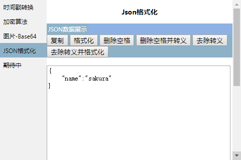

## 工具箱插件开发（Chrome）

### version 1.0版本  
### 1、支持时间戳转换操作 下载地址：[ITools-1.0.crx](https://raw.githubusercontent.com/licunzhi/ITools/master/crx/ITools-1.0.crx)  
  
### 2、支持md5，base64加密以及图片转换 下载地址：[ITools-2.0.crx](https://raw.githubusercontent.com/licunzhi/ITools/master/crx/ITools-2.0.crx)    
  
### 3、支持json数据格式化以及视图的展示下载地址：[ITools-3.0.crx](https://raw.githubusercontent.com/licunzhi/ITools/master/crx/ITools-3.0.crx)    
 